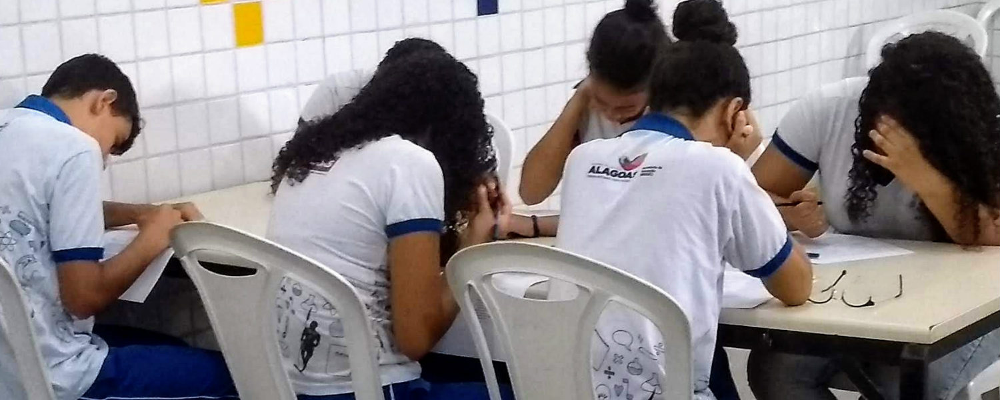

## Acão Curricular de Extensão - OBI: Olímpiada Brasileira de Informática

A OBI: Olímpiada Brasileira de Informática é uma competição organizada nos moldes das outras olimpíadas científicas brasileiras, como Matemática, Física e Astronomia. O objetivo da OBI é despertar nos alunos o interesse por uma ciência importante na formação básica hoje em dia (no caso, ciência da computação), através de uma atividade que envolve desafio, engenhosidade e uma saudável dose de competição. A organização da OBI está cargo do Instituto de Computação da UNICAMP. https://olimpiada.ic.unicamp.br/info/

O processo de inserção curricular da extensão da UFAL atende ao que está preconizado nos documentos nacionais que se referem às políticas para a Educação, que englobam, entre outros: o Plano Nacional de Educação, as Diretrizes Curriculares Nacionais para o ensino Superior e as as Diretrizes para a Extensão na Educação Superior Brasileira.


```
ESCOLA DE APLICAÇÃO DO SIMULADO:

Código INEP: 27016412
Localização da Escola: Urbana
Dependência	Estadual
Endereço: AV JOSE LUCIO DA SILVA
Bairro: JARDIM ESPERANCA
CEP: 57307430
Telefone: Não informado

```

```
EQUIPE RESPONSÁVEL:

José Aparecido da Silva
Livia Cavalante Batalha
Nayse da Silva Fagundes

Professor(a): Elthon Oliveria.
https://sites.google.com/site/el7hon
```

### INFORMAÇÕES SOBRE A APLICAÇÃO:
```
12/11/2019 - 9:00 ás 10:00.
Alunos(a) do 9º do ensino fundamental realizaram o simulado.
```



```
- PROVA - DOWNLOAD
- GABARITO - DOWNLOAD
```


### Contato

```
- jose.silva@arapiraca.ufal.br
- livia.cavalcante@arapiraca.ufal.br
- nayse.fagundes@arapiraca.ufal.br
```
